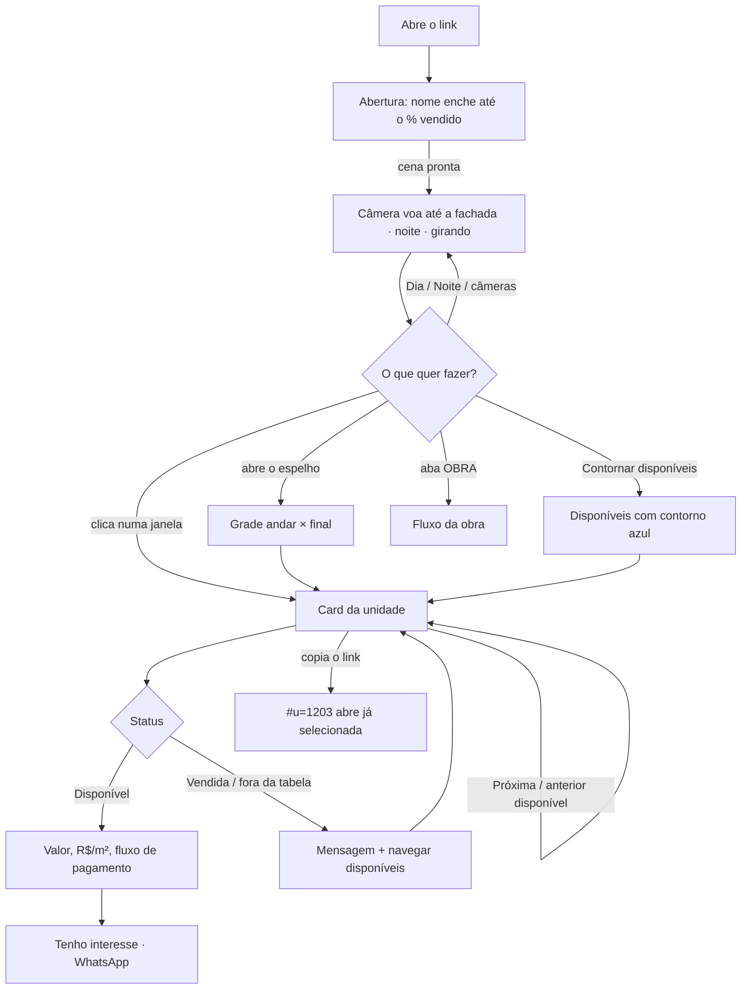
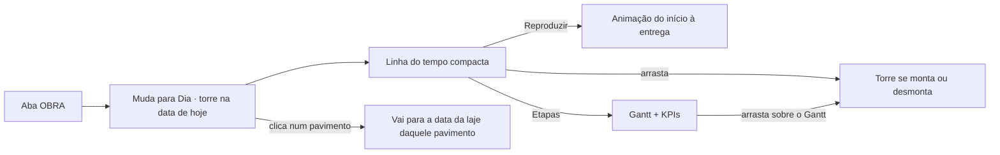
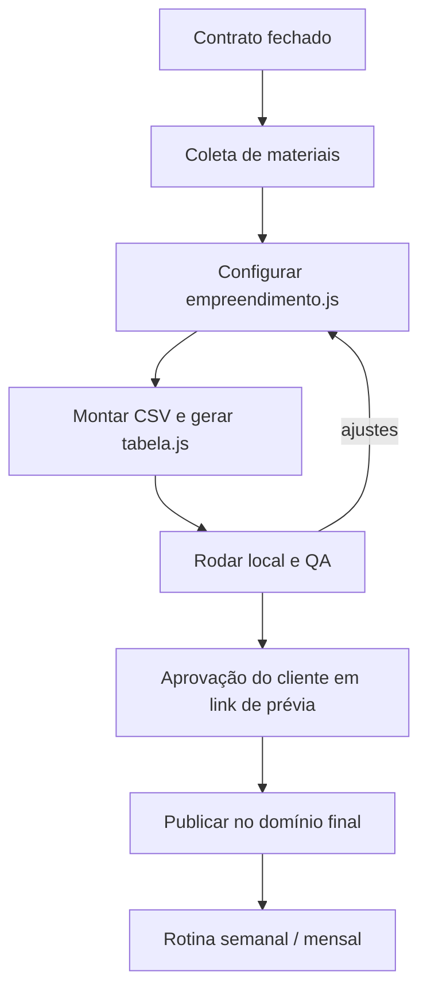
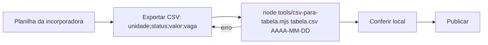

# Fluxos: usuário e operação

## 1. Fluxo do usuário (comprador ou corretor)



### Passo a passo
1. **Abertura** (≈3 s): o nome do empreendimento enche de dourado até o % vendido. Dá para pular.
2. **Primeira visão**: torre à noite, girando devagar. Luz acesa = vendida, apagada = disponível. Dica: "Clique em uma unidade na fachada".
3. **Explorar**: arrastar gira, roda ou pinça aproxima. Botões Frente, Lateral, Fundos e Rooftop.
4. **Encontrar disponíveis**: "Contornar disponíveis" ou o "Espelho por pavimento".
5. **Unidade**: o card mostra tudo; a câmera enquadra a unidade e ela pulsa na fachada.
6. **Comparar**: "Próxima disponível" percorre só as disponíveis, de baixo para cima.
7. **Compartilhar**: o endereço da página já vem com `#u=ID`.

## 2. Fluxo da obra



Leitura da tela: selo azul "situação real" até a data informada pela construtora; depois, "projeção". A frase de frente de obra junta as etapas em andamento, por exemplo "Esquadrias no 14º pavimento · acabamentos no 12º pavimento · lazer e paisagismo em andamento".

---

## 3. Onboarding de um novo empreendimento



### 3.1 O que pedir à incorporadora
| Item | Para quê | Campo |
|---|---|---|
| Nome, cidade, logo (SVG/PNG) e cores | identidade | `produto`, `incorporadora`, `cores` |
| Implantação e cortes (PDF) | largura, profundidade, alturas, pódio, ático | `torre` |
| Planta de cada pavimento-tipo e cobertura | finais, áreas, posição, sacadas | `plantas[].unidades[]` |
| Tabela de vendas (planilha) | status, valor, vaga | CSV |
| Condição de pagamento + nota de correção | fluxo do card | `pagamento`, `notaPagamento` |
| Cronograma físico (etapas e datas) + até quando é real | modo obra | `obra` |
| WhatsApp de atendimento (opcional) | botão de interesse | `contato` |

### 3.2 Como transformar a planta em `rect`
1. Na planta do pavimento-tipo, trace a projeção da torre: largura (eixo x, esquerda para a direita olhando a fachada principal) e profundidade (eixo z, fundos para a frente).
2. Coloque a origem no centro. Ex.: torre 24 × 16 m vai de x = -12 a 12 e z = -8 a 8.
3. Para cada unidade, anote o retângulo que ela ocupa, encostando na fachada onde tem janela: `[x0, z0, x1, z1]`.
4. O núcleo (hall, escadas, elevadores) fica sem unidade: vira parede.
5. Rode localmente. Se alguma unidade não tiver janela, o console mostra `Unidade X sem janela na fachada`.

Precisão de meio metro é suficiente: a área exibida vem do campo `area`, não do desenho.

### 3.3 Tempo estimado
| Etapa | Tempo |
|---|---|
| Configuração da torre e plantas | 2 a 4 h |
| Tabela (CSV) | 30 min |
| Cronograma | 30 min |
| QA + ajustes | 1 a 2 h |

---

## 4. Rotinas de atualização

### Semanal: tabela de vendas


```bash
node tools/csv-para-tabela.mjs data/tabela.csv 2026-10-05 "Observação da tabela"
```

O script recusa unidade com status inválido e disponível sem valor. A data aparece no header ("tabela de 05/10/2026").

### Mensal: obra
1. Atualize `obra.realAte` e `obra.notaReal` com o que já foi executado.
2. Se o cronograma mudou, ajuste os `periodos` das etapas.
3. Publique.

---

## 5. Checklist de QA antes de publicar

- [ ] Nome, cidade, número de unidades e data da tabela corretos no header
- [ ] % vendido da abertura = % do resumo = conta manual da planilha
- [ ] Todas as unidades com janela (console sem avisos)
- [ ] 3 unidades conferidas no card contra a planilha (valor, vaga, área, fluxo)
- [ ] Soma dos percentuais do pagamento = 100%
- [ ] Espelho: andares e finais batem com a planta
- [ ] Contornar disponíveis destaca as mesmas unidades azuis do espelho
- [ ] Dia, Noite, Frente, Lateral, Fundos, Rooftop sem cortes estranhos
- [ ] Obra: "Hoje" mostra a situação real; "Entrega" mostra a torre pronta; o Gantt bate com o cronograma
- [ ] Mobile (390 px): header, controles, card inferior e obra legíveis
- [ ] Link `#u=ID` abre a unidade certa

---

## 6. Publicação

O projeto é um site estático. Qualquer serviço serve a pasta inteira:

- **Netlify**: arraste a pasta no painel ou conecte um repositório. O `netlify.toml` já define `no-cache` para `/data/*`.
- **Vercel / Cloudflare Pages**: sem build command; diretório de saída = raiz.

Um empreendimento = um site (ou subdomínio): `aurora.suamarca.com.br`.
